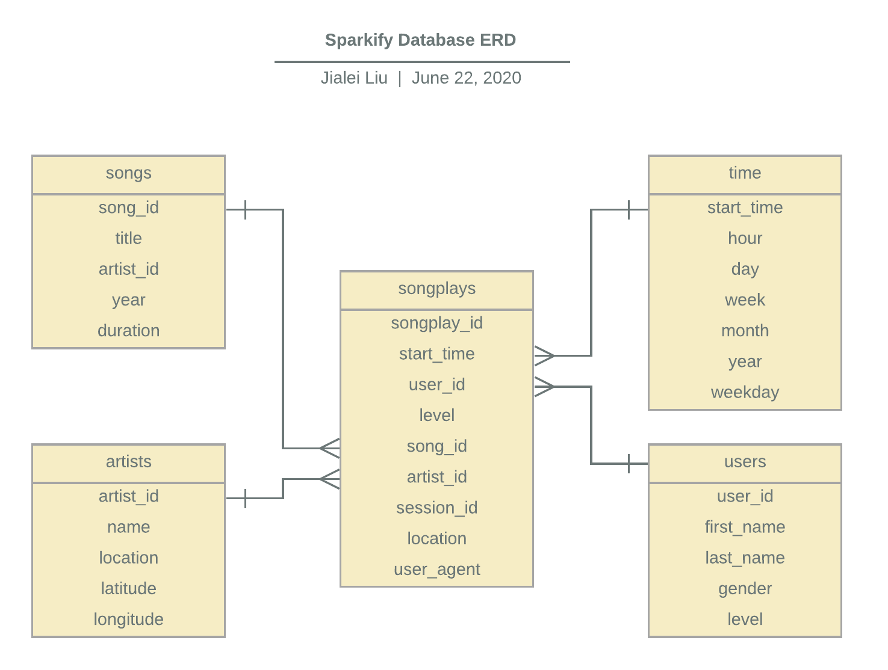

# Music Streaming App Data Modeling
## Date:6/19/2020

## Introduction
**Sparkify** is a startup which provides music streaming service. Their user actitvity data and songs information are origianlly stored in JSON files, making it hard to peform analysis on top. This project is to  build a PostgreSQL database and use ETL pipelines to populate data into database. In that case, queries can be easily performed by analytical team. They are mainly insterested in what songs users are listening to.

## Database schema

### Database intro
database name: sparkifydb   
There are five tables in the sparkifydb database.

### Fact table
- songplays:records in log data associated with song plays
songplay_id, start_time, user_id, level, song_id, artist_id, session_id, location, user_agent
### Dimesion tables
- users:users in the app
user_id, first_name, last_name, gender, level
- songs:songs in music database
song_id, title, artist_id, year, duration
- aritists: artists in music database
artist_id, name, location, latitude, longitude
- time: timestamps of records in songplays broken down into specific units
start_time, hour, day, week, month, year, weekday

## ETL pipeline
Use etl.py file to load data from JSON files into each table in sparkify database.

## Files included
- data.tar.gz: zipped data file which contains orinigal song and log data in JSON format.
- create_tables.py: used to create database and tables.
- etl.py: used to finish ETL process to load data into database tables.
- sql_queries.py: contains all drop, create, and insert queries string.
- database-test.ipynb: used to test if data is succuessfully loaded into database by querying the tables.

## How to use?
1. Unzip data into your local file system.
2. Place all .py and .pynb files under a same path.
3. Change the file path in etl.py based on your data location
4. Run the create_tables.py to create database and all tables.
5. Run the etl.py to finish the ETL process to load data.
6. Use database-test.ipynb to run a few queries to check if data is successfully loaded into database.
